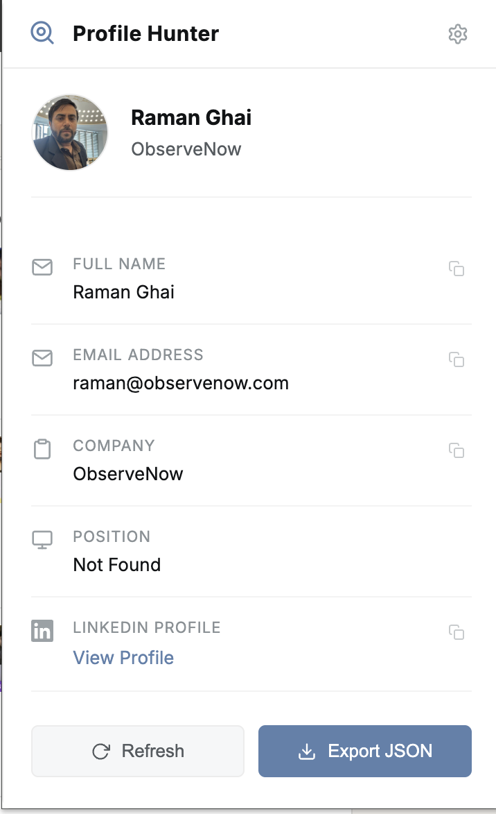
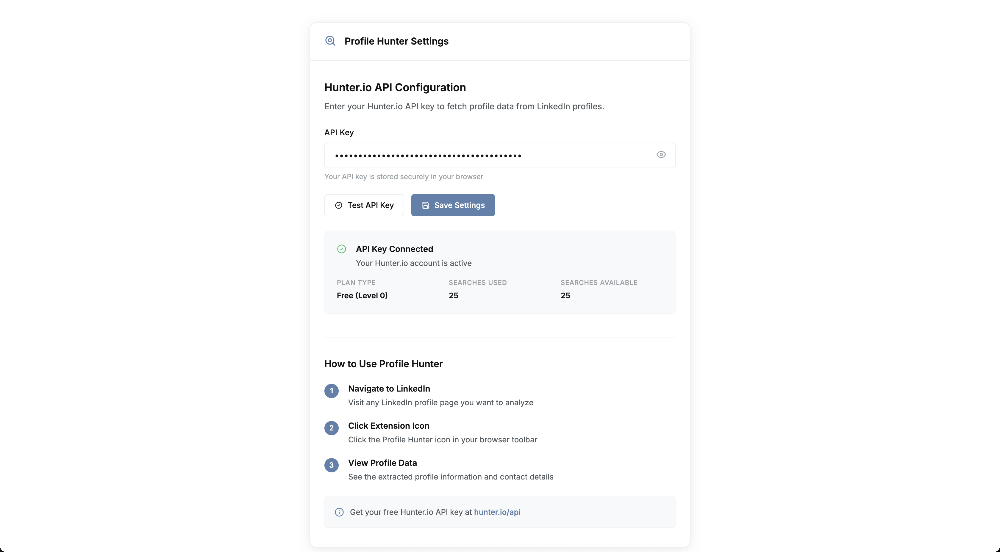

# Profile Hunter Chrome Extension

A modern Chrome extension that fetches LinkedIn profile data from Hunter.io API including Full Name, Email, Company, and Position with advanced domain extraction and JSON export capabilities.


## 🚀 Features

- **Hunter.io Integration**: Fetches comprehensive profile data from Hunter.io API with dual search strategy.
- **Complete Profile Data**: Returns Full Name, Email, Company/Organization, and Position.
- **Domain Extraction**: Automatically extracts company domains from LinkedIn for enhanced Hunter.io lookup.
- **Dual Search Strategy**: Uses both company name AND domain for maximum data discovery success.
- **JSON Export**: Export complete profile data as downloadable JSON files with user's name.
- **LinkedIn Photo Support**: Displays LinkedIn profile photos alongside Hunter.io data.
- **Modern Minimalist UI**: Clean, aesthetic interface with Nord blue accent color (#5E81AC).
- **Real-time API Testing**: Tests Hunter.io connectivity and provides usage statistics.
- **Privacy First**: Secure API key storage, data fetched directly from Hunter.io.
- **Professional Icons**: Complete SVG icon set with magnifying glass design.
- **Enhanced UX**: Popup closes on click-outside and ESC key, smooth interactions.
- **Unified Design**: Consistent minimal theme across popup and settings pages.
- **Visual Documentation**: Screenshots showcasing the clean, professional interface.

## 📸 Screenshots

### Main Popup Interface
(screenshots/popup2.png)

The main popup interface showing:
- Clean, minimal design with Nord blue accents
- Professional magnifying glass icon branding
- Settings button for easy configuration access
- Profile data display with one-click copy functionality

### Settings/Options Page


The settings page featuring:
- Unified design matching the popup interface
- Hunter.io API key configuration
- API connectivity testing
- Usage statistics and account information

## 🎨 Design Features

The extension features a minimalist interface with:
- Clean white background with subtle gray accents
- Nord blue (#5E81AC) accent color for interactive elements
- Inter font typography for modern readability
- Smooth loading states and error handling
- One-click copying for all data fields
- Professional magnifying glass icons throughout
- Consistent design between popup and settings pages
- Enhanced popup behavior (ESC key and click-outside to close)
- Easy settings access via dedicated button in popup header

## 🛠 Installation

### Prerequisites
- Google Chrome browser
- Hunter.io API key (free tier available)

### Step 1: Download the Extension
1. Download the ZIP file from the repository
2. Extract it to a folder on your computer

### Step 2: Load in Chrome
1. Open Chrome and navigate to `chrome://extensions/`
2. Enable "Developer mode" (toggle in top-right corner)
3. Click "Load unpacked"
4. Select the extracted extension folder
5. The extension should now appear in your Chrome toolbar

### Step 3: Configure Hunter.io API Key
1. Click the extension icon in your toolbar
2. Click the settings button (⚙️) in the top-right corner of the popup
3. Get your free API key from [Hunter.io](https://hunter.io/pricing)
4. Enter your API key in the settings page
5. Click "Test API Key" to verify it works
6. Click "Save Settings"

## 🔑 Getting Your Hunter.io API Key

### Free Plan (25 requests/month)
1. Visit [Hunter.io](https://hunter.io/pricing)
2. Sign up for a free account
3. Verify your company email address
4. Navigate to your API dashboard
5. Copy your API key
6. Paste it in the extension settings

### API Key Security
- Your API key is stored locally in Chrome's secure storage
- It's never shared with third parties
- Only used for Hunter.io API calls

## 🎯 How to Use

### Basic Usage
1. **Navigate** to any LinkedIn profile page (e.g., `linkedin.com/in/username`)
2. **Click** the Profile Hunter extension icon in your Chrome toolbar
3. **Wait** for the extension to fetch profile data from Hunter.io using dual search strategy
4. **View** the results in the popup window
5. **Copy** any data field with one click
6. **Export** complete data as JSON using the "Export JSON" button
7. **Close** the popup by pressing ESC or clicking outside

### New Features
#### JSON Export
- Click the **"Export JSON"** button next to the Refresh button
- Downloads a file named `{UserName}_{Date}.json` (e.g., `John_Doe_2025-09-12.json`)
- Contains both LinkedIn scraped data and Hunter.io verified data
- Perfect for data analysis, CRM import, or backup purposes

#### Enhanced Data Discovery
- **Dual Search**: Uses both company name ("Masai School") and domain ("masaischool.com") 
- **Smart Fallback**: If company name search fails, automatically tries domain search
- **Domain Extraction**: Automatically extracts domains from LinkedIn company URLs
- **Higher Success Rate**: Significantly improved data discovery compared to single search method

### Settings Access
- Click the settings button (⚙️) in the top-right corner of the popup
- Test your API key connectivity and view usage statistics
- Access all Hunter.io configuration options

### Test Profile
Try the extension with this LinkedIn profile:
```
https://www.linkedin.com/in/raman-ghai-8bb7b418/
```

### What Data is Fetched from Hunter.io
- **Full Name**: First and last name from Hunter.io database
- **Email**: Professional email address 
- **Company**: Current employer/organization (prioritizes Hunter.io data over LinkedIn metadata)
- **Position**: Job title/designation
- **Domain**: Company website domain (extracted from LinkedIn or Hunter.io)
- **Profile Photo**: LinkedIn profile picture (for display)
- **Profile URL**: Direct link to LinkedIn profile
- **Verification Status**: Email verification details from Hunter.io

### Hunter.io API Response Format
```json
{
  "data": {
    "first_name": "John",
    "last_name": "Doe", 
    "email": "john.doe@company.com",
    "score": 98,
    "domain": "company.com",
    "company": "Company Name",
    "position": "Software Engineer",
    "verification": {
      "date": "2025-09-11",
      "status": "valid"
    }
  }
}
```

### JSON Export Format
The exported JSON file contains comprehensive profile data:
```json
{
  "exportInfo": {
    "timestamp": "2025-09-12T12:02:53.611Z",
    "exportedBy": "Profile Hunter Extension",
    "version": "1.0.0"
  },
  "profile": {
    "linkedinData": {
      "fullName": "John Doe",
      "designation": "Software Engineer",
      "organisation": "Company Name",
      "domain": "company.com",
      "profileImage": "https://media.licdn.com/...",
      "linkedinUrl": "https://www.linkedin.com/in/johndoe/"
    },
    "hunterIoData": {
      "fullName": "John Doe",
      "email": "john@company.com",
      "company": "Company Name",
      "position": "Software Engineer"
    }
  }
}
```

### Advanced Search Strategy
The extension uses a sophisticated dual-search approach:

1. **Primary Search**: Company name extraction from LinkedIn
   - `api.hunter.io/v2/email-finder?company=Masai%20School&first_name=John&last_name=Doe`

2. **Fallback Search**: Domain extraction from LinkedIn company URLs
   - Extracts from `/company/masaischool/` → `masaischool.com`
   - `api.hunter.io/v2/email-finder?domain=masaischool.com&first_name=John&last_name=Doe`

3. **Combined Search**: Both parameters in single API call
   - `api.hunter.io/v2/email-finder?company=Masai%20School&domain=masaischool.com&first_name=John&last_name=Doe`

This approach significantly increases data discovery success rates.

## 🔧 Troubleshooting

### Common Issues

#### "Not a LinkedIn Profile" Error
- Make sure you're on a LinkedIn profile page (`linkedin.com/in/username`)
- Refresh the page and try again
- Check that you're logged into LinkedIn

#### "No Data Found" Error
- The person might not be in Hunter.io's database
- Try with different LinkedIn profiles with more common companies
- Check your Hunter.io API key in settings
- The extension now tries both company name and domain - if both fail, the person/company may not be in Hunter.io's database

#### "Email Not Found" Error
- Hunter.io doesn't have email data for this person/company
- Try with profiles from larger, well-known companies
- The dual search strategy increases success rates significantly
- This is normal - not all emails are discoverable

#### JSON Export Issues
- **File not downloading**: Check browser's download settings and popup blockers
- **Empty data**: Ensure Hunter.io data was successfully fetched before exporting
- **Filename issues**: Special characters in names are automatically cleaned for valid filenames

### API Rate Limits
- Free Hunter.io plan: 25 requests/month
- **Optimized Usage**: Single API call now uses both company and domain parameters
- Requests reset monthly
- Check usage in extension settings
- Upgrade Hunter.io plan if needed

### Data Quality Notes
- **Hunter.io Priority**: Extension prioritizes verified Hunter.io data over LinkedIn scraped metadata
- **Smart Mapping**: Company data from Hunter.io automatically overrides LinkedIn scraped company names
- **Domain Intelligence**: Automatically cleans and converts LinkedIn company slugs to potential domains
- **Fallback Protection**: Uses LinkedIn data only when Hunter.io data is unavailable

## 📁 Project Structure

```
linkedin-profiler-extension/
├── manifest.json              # Extension configuration and permissions
├── popup/
│   ├── popup.html            # Main popup interface with export button
│   ├── popup.css             # Modern minimal styling
│   └── popup.js              # Enhanced popup functionality with JSON export
├── content/
│   └── content.js            # LinkedIn data extraction with domain intelligence
├── background/
│   └── background.js         # Hunter.io API integration with dual search
├── options/
│   ├── options.html          # Settings page with unified design
│   ├── options.css           # Minimal settings styling 
│   └── options.js            # Settings functionality
├── icons/
│   ├── favicon.svg           # Browser tab favicon (16x16)
│   ├── icon16.svg            # Extension toolbar icon
│   ├── icon32.svg            # Extension management icon
│   ├── icon48.svg            # Extension details icon
│   └── icon128.svg           # Chrome Web Store icon
├── screenshots/
│   ├── popup.png             # Main popup interface screenshot
│   └── options.png           # Settings page screenshot
└── README.md                # Complete documentation
```

## 🛡 Privacy & Security

- **No Data Collection**: We don't collect or store any personal data
- **Local Processing**: All profile extraction happens locally
- **Secure Storage**: API keys stored in Chrome's encrypted storage
- **HTTPS Only**: All API calls use secure connections
- **No Tracking**: No analytics or user tracking

## 🚀 Technical Details

### Technologies Used
- **Manifest V3**: Latest Chrome extension standard with proper permissions
- **Vanilla JavaScript**: No external dependencies, optimized performance
- **CSS Grid/Flexbox**: Modern responsive design with CSS variables
- **Chrome APIs**: Storage, tabs, scripting, runtime, downloads
- **Inter Font**: Modern, readable UI typography
- **SVG Icons**: Scalable vector graphics for crisp display at all sizes
- **Nord Color Palette**: Professional blue accent (#5E81AC) for consistency
- **Blob API**: Client-side JSON file generation for exports

### Key Improvements (Latest Version)
- **Domain Extraction**: Intelligent parsing of LinkedIn company URLs to domains
- **Dual Search Strategy**: Company name + domain search for higher success rates
- **JSON Export**: Complete profile data export functionality
- **Data Prioritization**: Hunter.io verified data takes precedence over LinkedIn metadata
- **Smart Company Mapping**: Automatic conversion of LinkedIn company slugs to domains
- **Enhanced Error Handling**: Better feedback for various failure scenarios
- **Optimized API Usage**: Single API call with multiple parameters

### Browser Support
- Chrome 88+
- Chromium-based browsers (Edge, Brave, etc.)

### Permissions Required
- `activeTab`: Access current LinkedIn tab
- `storage`: Save API key securely
- `scripting`: Extract profile data
- `host_permissions`: LinkedIn and Hunter.io domains


### Development Setup
1. Clone the repository
2. Load the extension in developer mode
3. Make your changes
4. Test thoroughly
5. Submit a pull request

## 📄 License

This project is licensed under the MIT License - see the [LICENSE](LICENSE) file for details.

